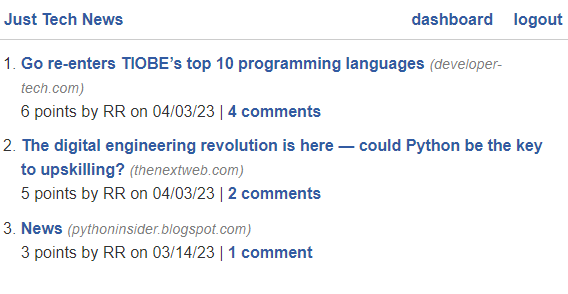

# refactor-python-newsfeed
[](https://opensource.org/licenses/MIT)

## Description
Code refactor - newsfeed app originally built using Node.js, refactored to use Python

## Preview
<div style="border: 1px solid black; padding: 5px;">
  
</div>
## Link to Application
App available at: https://renata-newsfeed-python.herokuapp.com/

## Table of Contents

- [Installation](#installation)
- [Usage](#usage)
- [Features](#features)
- [License](#license)
- [Contributing](#contributing)
- [Tests](#tests)
- [Questions](#questions)
- [Credits](#credits)

## Installation

1. Install package manager - PIP

```
pip install
```

2. Install Flask, SQLAlchemy, PyMySQL, bcrypt, python-dotenv, and Gunicorn packages using pip by running the following command in the terminal:

```
pip install flask sqlalchemy pymysql bcrypt python-dotenv gunicorn
```
3. Virtual Environment:

    - Clone or download the Python-News App repository from GitHub to your local machine.
    - Navigate to the app directory using the terminal.
    - Create a virtual environment 
    - Activate the virtual environment using the following command:

```` 
 .\venv\Scripts\activate
````
4. Run the application:

````
python -m flask run
````

## Usage

1. Post a new article
2. Edit a post - edit title or delete
3. Comment icon - click over icon to open posts single page and add a comment
4. Upvote - heart icon on single page post will upvote the article


## Features

1. Posting, editing, and deleting news articles
2. Commenting on articles
3. Upvoting  articles
4. User authentication and authorization
5. Password hashing for secure user authentication
6. User dashboard page to view and edit posts
7. Responsive design to adapt to different screen sizes
8. Deployment using Gunicorn for a production-ready server.

<div style="border: 1px solid black; padding: 5px;">
  
</div>

## License
[](https://opensource.org/licenses/MIT)

This application is covered by MIT license, available at:
https://opensource.org/licenses/MIT

## Contributing
 Please feel free to send a pull request, the following is my GitHub account: https://github.com/Renatatims

## Tests
To run the application, make sure the virtual environment is activated and run the following command:

````
python -m flask run
````

## Questions

  If you have any questions please contact me at:
   - GitHub account:https://github.com/Renatatims
   - e-mail account: renatatims@gmail.com

## Credits
 - Extension course: Python - edX Boot Camps LLC
 - https://pythonbasics.org/flask-tutorial-routes/
